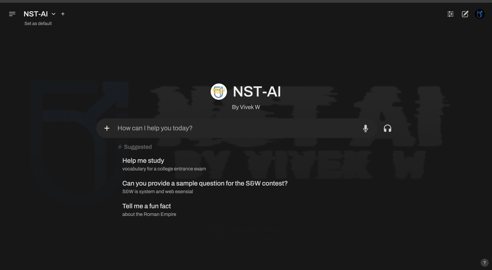

# NST-Ai: Your Personal AI Study Buddy 🚀

**NST-Ai is a powerful, open-source AI study assistant designed to help students learn, code, and research more effectively. Think of it as your personal AI tutor, always ready to assist you.**

---

## ✨ Project Highlights

NST-Ai is more than just a chatbot. It's a comprehensive tool designed for students and developers.

<p align="center">
  
</p>

### 💬 Engaging Conversations

Have natural and dynamic conversations with your AI assistant. 

<p align="center">
  
  
</p>

### 🧠 Multiple AI Models

Switch between different AI models to get the best assistance for your specific needs.

<p align="center">
  
</p>

### 💻 Code Like a Pro

Get help with coding, debugging, and even run code snippets directly within the interface.

<p align="center">
  
</p>

### 🌐 Web Development Assistant

NST-Ai can assist with web development tasks, making it a great companion for your projects.

<p align="center">
  
</p>

--- 

## 🚀 1-Click Installation

Get started with NST-Ai in minutes with our simple one-line installation script.

```bash
curl -fsSL https://raw.githubusercontent.com/AryanVBW/NST-Ai/main/install.sh | bash
```

After installation, simply run `nst-ai` in your terminal to start the application. The web interface will be available at [http://localhost:8080](http://localhost:8080).

For other installation methods, including Docker and pip, please refer to our [Installation Guide](INSTALLATION.md).

### 💻 Development Setup

For developers who want to run NST-AI locally with the complete workflow integration:

**📖 [Development Setup Guide](DEVELOPMENT_SETUP.md)** - Complete step-by-step instructions

**Quick Start:**
```bash
# Frontend (Terminal 1)
npm install && npm run dev

# Backend (Terminal 2) 
cd backend && source venv/bin/activate
pip install fastapi uvicorn python-multipart
PYTHONPATH=$PWD python -m uvicorn nst_ai.main:app --host 0.0.0.0 --port 8080
```

**Access Points:**
- Frontend: http://localhost:5173/
- Backend API: http://localhost:8080/
- **New!** NST-AI Workflow: Click "NST-AI Workflow" tab in sidebar

--- 

## 🎬 More Features in Action

<p align="center">
  <b>Qurion Chat</b><br>
  
</p>

<p align="center">
  <b>Sign-in Process</b><br>
  
  <br><i>Seamless and secure sign-in and sign-up.</i>
</p>

<p align="center">
  
  
</p>


<p align="center">
  <b>Command Line Interface</b><br>
  
</p>


<p align="center">
  <b>Compiler Feature</b><br>
  
</p>

<p align="center">
  <b>Database Feature</b><br>
  
</p>

--- 

## 🙏 Attribution and Acknowledgments

NST-Ai is proudly built upon the foundation of the open-source [Open-WebUI](https://github.com/open-webui/open-webui) project. We extend our gratitude to the original creators and the community for their incredible work.

This project is developed for **educational purposes** to serve as an AI Study Buddy.

For full attribution details, see the [ATTRIBUTION.md](ATTRIBUTION.md) file.

## 📜 License

This project is licensed under the [NST-Ai License](LICENSE), a revised BSD-3-Clause license. Please see the [LICENSE](LICENSE) file for more details.

## 💬 Support

Have questions or need help? Open an issue on our [GitHub repository](https://github.com/AryanVBW/NST-Ai/issues).

